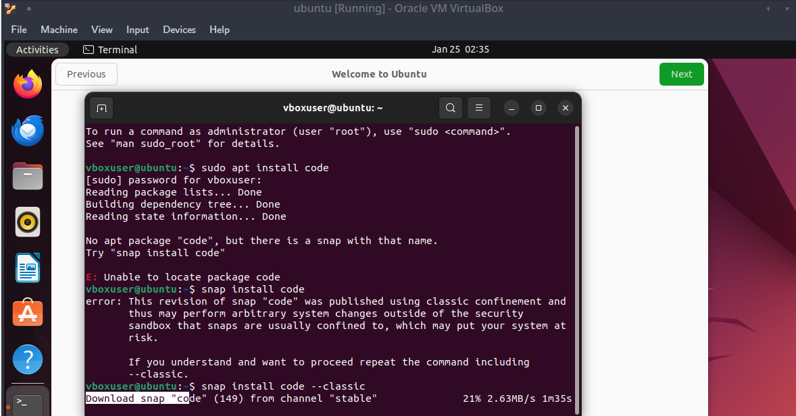
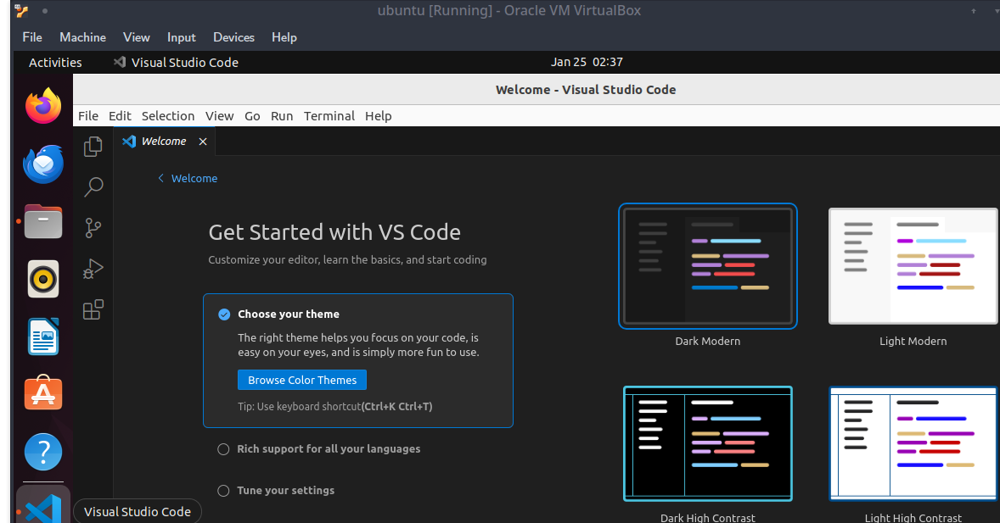
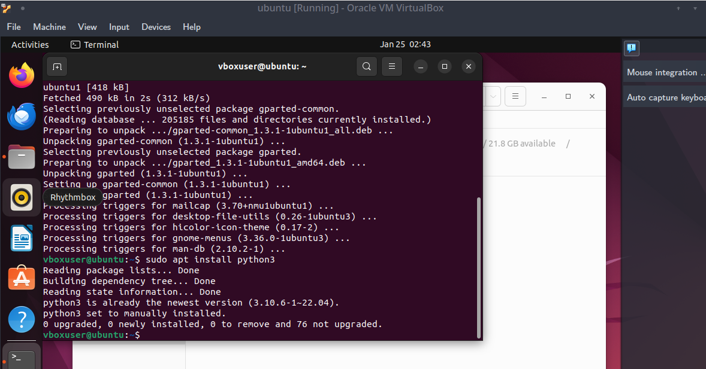
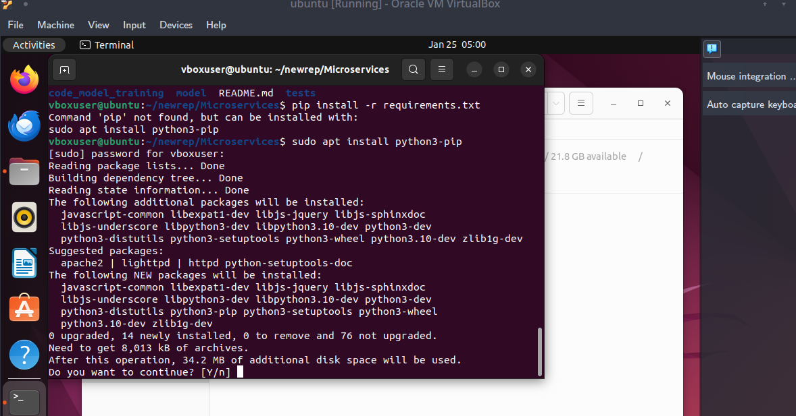
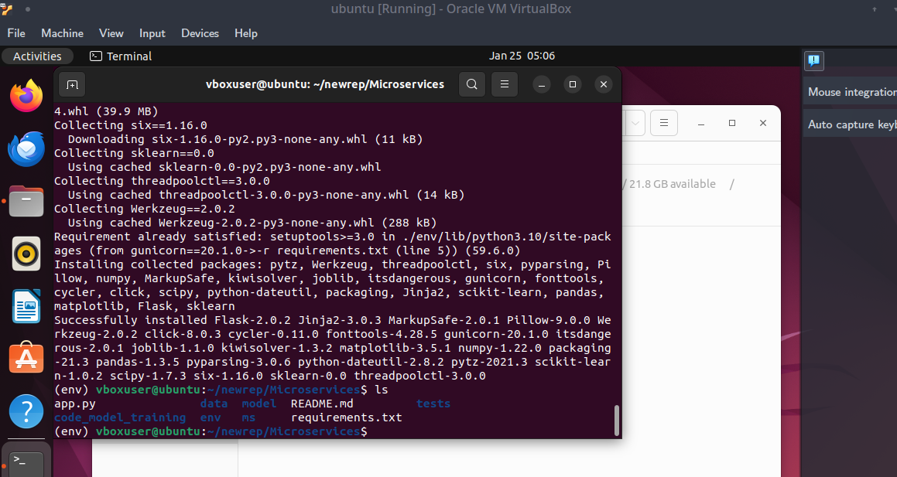
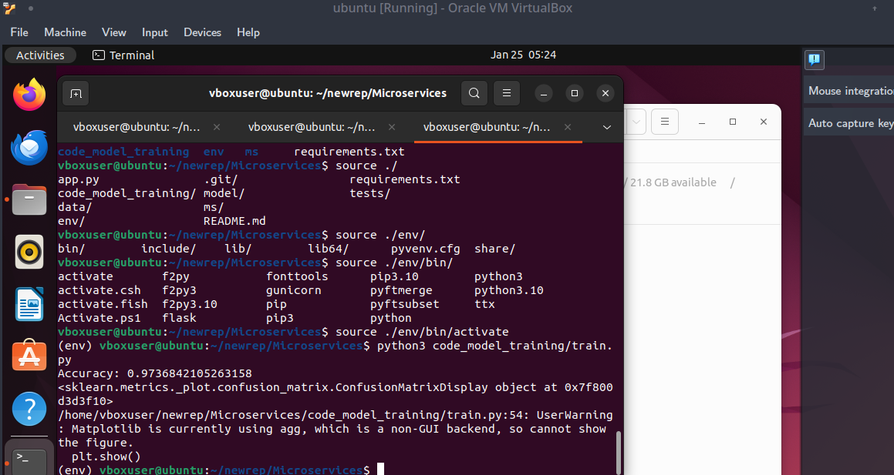
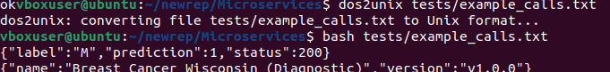
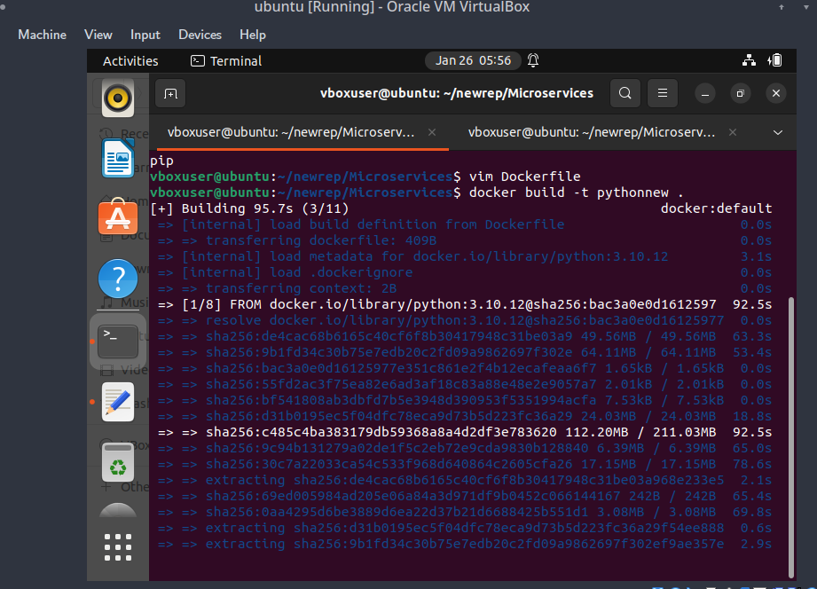
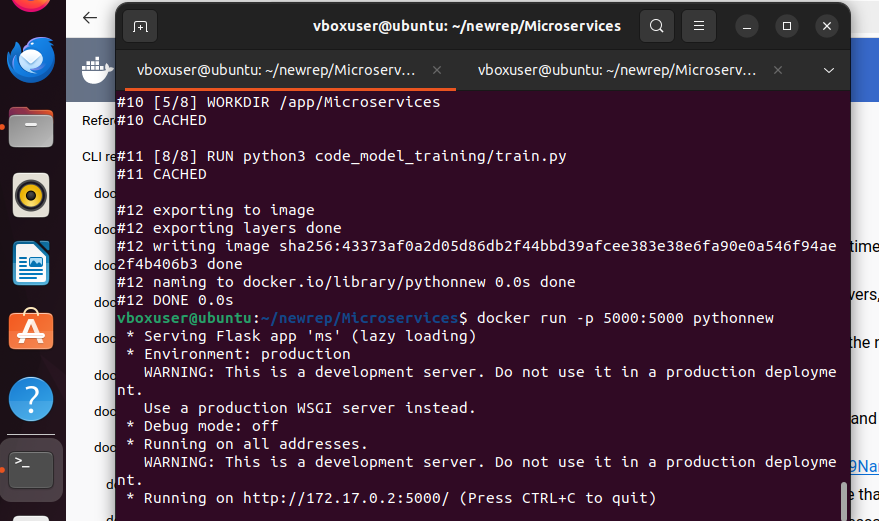
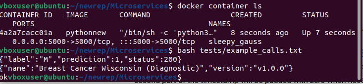

## Running Ubuntu

## Setting up VSCode

## Set up Python

## 

## Setup venv and install requirements

## Train model

## Test

## Test using the tests

## Create docker

#### Creating dockerfile

#### Building docker

## Run and Test Docker

#### Running docker

#### Predicting using Docker

